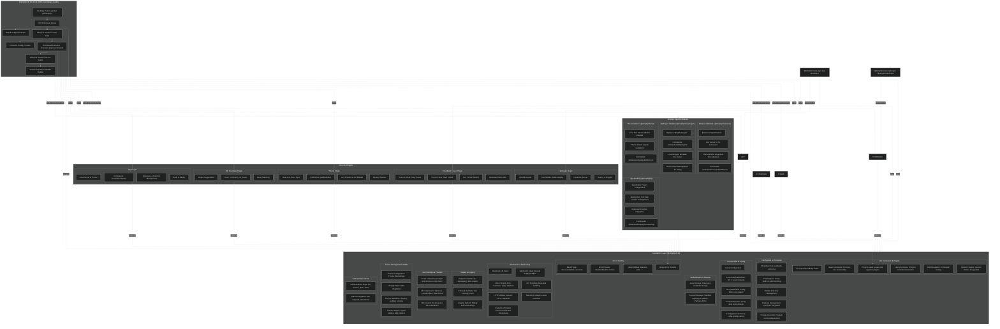

```mermaid
---
config:
  theme: dark
  layout: elk
---
flowchart TB
subgraph AuthSession["Authentication & Session"]
	direction TB
	SessionMgmt["Session Manager: Handles login/logout (Admin, Partners APIs)"]
	LocalConfig["Local Storage: Token and credential storage"]
end
subgraph OutputLogging["Output & Logging"]
	direction TB
	OutputFmt["Output Formatter: CLI messaging, table outputs"]
	ColorsFX["Colors & Symbols: CLI coloring, icons"]
	Logging["Logging System: Debug and verbose logs"]
end
subgraph UIUX["User Interface & Prompts"]
	direction TB
	InkUI["Ink UI: Interactive prompts and terminal components"]
	UIComponents["UI Components: Spinners, progress bars, input forms"]
	Notifications["Notifications: Desktop and OS notifications"]
end
subgraph FileSys["File System & Processes"]
	direction TB
	FSUtils["FS Utilities: File read/write, archiving"]
	PathUtils["Path Helpers: Cross-platform path handling"]
	HiddenDir["Hidden Directory Management"]
	PkgManager["Package Management: npm/yarn integration"]
	ProcExec["Process Execution: System command execution"]
end
subgraph EnvConfig["Environment & Config"]
	direction TB
	EnvDetect["Environment Detection: OS, CI environments"]
	EnvVars["Env Variables & Config Files (.env loader)"]
	Contexts["Context Detection: Local, Spin environments"]
	GlobalCfg["Global Configuration"]
	ConfigSchema["Configuration Schemas: TOML/JSON parsing"]
end
subgraph GitHub["Git & Version Control"]
	direction TB
	GitOps["Git Operations: Repo init, commit, push, clone"]
	GitHubAPI["GitHub Integration: API requests, repositories"]
end
subgraph APIClients["API Clients & Networking"]
	direction TB
	AdminAPI["Admin API Client: Shopify GraphQL/REST"]
	PartnersAPI["Partners API Client: Partner dashboard interactions"]
	StorefrontAPI["Storefront API Client"]
	OtherAPIs["Other Shopify APIs: Functions, Apps, Platform"]
	Throttle["API Throttling: Rate-limit handling"]
	HTTPUtils["HTTP Utilities: Generic HTTP requests"]
	Telemetry["Telemetry: Analytics event collection"]
end
subgraph Errors["Error Handling"]
	direction TB
	ErrorTypes["Error Classes: Standardized CLI errors"]
	AbortUtils["Abort Utilities: Graceful exits"]
	ErrorHandler["Global Error Handler"]
	ResultType["Result Type: Success/Failure outcomes"]
end
subgraph CLIFramework["CLI Framework & Plugins"]
	direction TB
	BaseCommand["Base Command: Common CLI functionality"]
	PluginLoader["Plugin Loader: Loads and registers plugins"]
	Hooks["Lifecycle Hooks: Pre/post command execution"]
	CLILauncher["CLI Launcher & Entry Point"]
	OclifIntegration["Oclif Integration: Command routing"]
	UpdateCheck["Update Checker: Version checks & upgrades"]
end
subgraph Themes["Theme Management Utilities"]
	direction TB
	ThemeConfig["Theme Configuration: Theme files/settings"]
	ThemeAPI["Shopify Theme API Integration"]
	ThemeManager["Theme Operations: Deploy, publish, preview"]
	ThemeUtils["Theme Helpers: Liquid utilities, URL builders"]
end
subgraph FOUNDATION["Foundation Layer (@shopify/cli-kit)"]
	direction TB
	AuthSession
	OutputLogging
	UIUX
	FileSys
	EnvConfig
	GitHub
	APIClients
	CLIFramework
	Errors
	Themes
end
subgraph App_Module["App Module (@shopify/app)"]
	direction TB
	AppCmds["Commands: init/dev/build/deploy/release/logs"]
	AppModel["App Model: Project configuration"]
	AppDeploy["Deployment Tool: App version management"]
	AppExtIntegration["Extension/Function integration"]
end
subgraph Extension_Module["Extension Module (@shopify/extension)"]
	direction TB
	ExtCmds["Commands: create/push/connect/build/serve"]
	ExtSpecs["Extension Specifications"]
	ExtDevServer["Dev Server for UI extensions"]
	ExtThemeCheck["Theme Check Integration for extensions"]
end
subgraph Theme_Module["Theme Module (@shopify/theme)"]
	direction TB
	ThemeCmds["Commands: init/dev/push/pull/publish/check"]
	ThemeDevServer["Local Dev Server with live preview"]
	ThemeLint["Theme Check (Liquid validation)"]
end
subgraph Hydrogen_Module["Hydrogen Module (@shopify/cli-hydrogen)"]
	direction TB
	HydroCmds["Commands: init/dev/build/deploy/link"]
	HydroDev["Local Oxygen Emulator Dev Server"]
	HydroDeploy["Deploy to Shopify Oxygen"]
	HydroEnv["Environment Management & Linking"]
end
subgraph DOMAIN_MODULES["Domain-Specific Modules"]
	direction TB
	App_Module
	Extension_Module
	Theme_Module
	Hydrogen_Module
end
subgraph App_Plugin["App Plugin"]
	direction TB
	AP_CMD["Commands: create/dev/deploy"]
	AP_EXT["Extension & Function Management"]
	AP_DEV["Local Server & Tunnel"]
	AP_DEPLOY["Build & Deploy"]
end
subgraph Theme_Plugin["Theme Plugin"]
	direction TB
	TH_CMD["Commands: pull/push/dev"]
	TH_DEV["Live Preview & Hot Reload"]
	TH_SYNC["Real-time Store Sync"]
	TH_DEPLOY["Deploy Themes"]
end
subgraph Cloudflare_Tunnel_Plugin["Cloudflare Tunnel Plugin"]
	direction TB
	CF_PRE["Pre-run Hook: Start Tunnel"]
	CF_RUN["Run Tunnel Service"]
	CF_POST["Post-run Hook: Stop Tunnel"]
	CF_URL["Generate Public URL"]
end
subgraph DidYouMean_Plugin["Did You Mean Plugin"]
	direction TB
	DYM_HOOK["Hook: command_not_found"]
	DYM_MATCH["Fuzzy Matching"]
	DYM_OUT["Output Suggestions"]
end
subgraph Hydrogen_Plugin["Hydrogen Plugin"]
	direction TB
	HY_CMD["Commands: init/dev/deploy"]
	HY_DEV["Local Dev Server"]
	HY_BUILD["Build & Bundle"]
	HY_DEPLOY["Deploy to Oxygen"]
end
subgraph PLUGINS["Core CLI Plugins"]
	direction TB
	App_Plugin
	Theme_Plugin
	Cloudflare_Tunnel_Plugin
	DidYouMean_Plugin
	Hydrogen_Plugin
end
subgraph CLI["@shopify/cli: CLI Core (Oclif router/plugin loader)"]
	direction TB
	EntryPoint["CLI Entry Point Launcher (bin/shopify)"]
	Router["Oclif Command Router"]
	PreHooks["Lifecycle Hooks: Pre-run tasks"]
	PostHooks["Lifecycle Hooks: Post-run tasks"]
	CommandExec["Command Execution: Executes plugin commands"]
	HelpSystem["Help & Usage Generator"]
	UpdateNotifier["Version Checker & Update Notifier"]
	ContextProvider["Context & Config Provider"]
end                          

EntryPoint --> Router
Router --> PreHooks
PreHooks --> CommandExec
Router -.-> PluginLoader & HelpSystem
PreHooks -.-> ContextProvider
CommandExec --> PostHooks
CommandExec -- on error --> ErrorHandler
PostHooks --> UpdateNotifier
CLI -- loads commands from --- APP["APP"] & EXTENSION["EXTENSION"] & THEME["THEME"] & HYDROGEN["HYDROGEN"]
CLI -- loads --- App_Plugin & Theme_Plugin & Cloudflare_Tunnel_Plugin & DidYouMean_Plugin & Hydrogen_Plugin
APP -- relies on --> FOUNDATION
EXTENSION -- relies on --> FOUNDATION
THEME -- relies on --> FOUNDATION
HYDROGEN -- relies on --> FOUNDATION
App_Plugin -- relies on --> FOUNDATION
Theme_Plugin -- relies on --> FOUNDATION
Cloudflare_Tunnel_Plugin -- relies on --> FOUNDATION
DidYouMean_Plugin -- relies on --> FOUNDATION
Hydrogen_Plugin -- relies on --> FOUNDATION
CREATE_APP["@shopify/create-app: App Generator"] -- initializes via --- APP
CREATE_HYDRO["@shopify/create-hydrogen: Hydrogen Generator"] -- initializes via --- HYDROGEN
CREATE_APP -- uses --> FOUNDATION
CREATE_HYDRO -- uses --> FOUNDATION
CLI --> DOMAIN_MODULES
DOMAIN_MODULES --> FOUNDATION
```